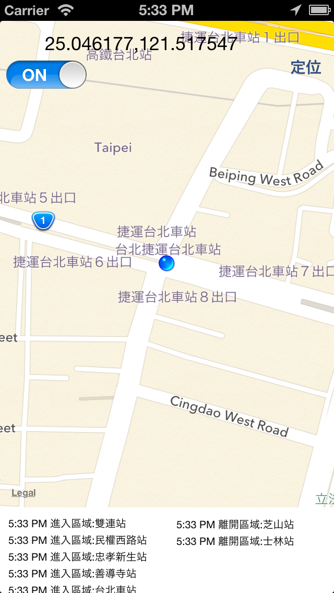
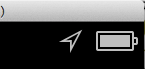

Geofence for iOS
========
</img>

-------
</img>

You can see Geofence in your statusBar.

in iOS 5,6 you can monitoring in app closed.  
work in App Open,Background,Closed

in iOS 7 , only work in App  Open,Background

------
Test location is in GPX folder

Peter Lee  
August 15, 2013

